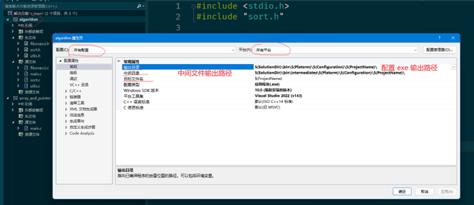

## Visual Studio 配置输出路径



解决方案中的每个项目都要单独设置，在项目上右击选择属性。

<!-- truncate -->

下面贴出我的配置：

## EXE 输出路径

```bash
$(SolutionDir)\bin\$(Platorm)\$(Configuration)\$(ProjectName)\
```

## 中间文件输出目录

```bash
$(SolutionDir)\bin\intermediates\$(Platorm)\$(Configuration)\$(ProjectName)\
```

