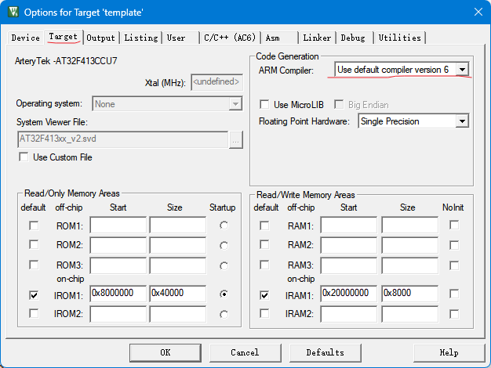

作为第一个 `FreeRTOS` 系统，我们第一步要做的就是把 `FreeRTOS` 移植到我们的单片机上，这里我用的单片机为: `at32f413CCU7`，开发环境为 `MDK5`。

## MDK 编译器选择

这里我选择了 `V6` 版本的编译器，设置方法在：



:::tip
注意：选择 `V6` 版本后的编译器后，所以我们不能使用 `RVDS` 下面的 `port.c` 和 `portmacro.h`，而是要用：`GCC` 目录下的对应平台中的 `port.c` 和 `portmacro.h`
:::

## IO 设定

这里我们要座的就是让 `PA0` 口接的 `LED` `500ms`闪烁一次。

## 注释掉 SVC_Handler，PendSV_Handler，SysTick_Handler

我们用的是 `AT32` 的固件库，这几个函数在 `at32f413_int.c` 文件中。

## FreeRTOSConfig.h

```c
/**
 * @file        : FreeRTOSConfig.h
 * @brief       : FreeRTOS 配置文件
 * @author      : 小土坡
 * @email       : xiaotupo@163.com
 * @version     : V1.0.1
 * @date        : 2023-1-20
 * @license     : 许可
 *
 * @github      : https://github.com/xiaotupo-com
 * @site        : https://xiaotupo.com
 *
 * @note        :
 *
 */

#ifndef __FREERTOS_CONFIG_H
#define __FREERTOS_CONFIG_H

#include "at32f413.h"

#define configUSE_PREEMPTION 1 /* 1: 使用抢占式调度器，1: 使用合作式调度器 */

/**
 * 钩子函数配置：
 * 钩子函数的主要功能是用于函数的扩展，用户可以根据自己的需要往里面添加相关的测试函数。
 * 1：使能空闲任务钩子函数
 * 0：禁能空闲钩子函数
 */
#define configUSE_IDLE_HOOK 0

/**
 * 配置滴答定时器钩子函数；
 * 1: 使能滴答定时器中断里面执行的钩子函数
 * 0: 禁能滴答定时器里面执行的钩子函数
 */
#define configUSE_TICK_HOOK 1

/**
 * CPU 时钟频率设置：GD32F150 是 72MHz
 */
#define configCPU_CLOCK_HZ ((unsigned long)SystemCoreClock)

/**
 * 此参数用于定义系统时钟节拍数，单位Hz，一般取1000Hz即可。
 */
#define configTICK_RATE_HZ ((TickType_t)1000)

/**
 * 此参数用于定义可供用户使用的最大优先级数，如果这个定义的是5，那么用户可以使用的优先级号是0,1,2,3,4，不包含5，对于这一点，初学者要特别的注意。
 */
#define configMAX_PRIORITIES (5)

/**
 * 此参数用于定义空闲任务的栈空间大小，单位字，即4字节。
 */
#define configMINIMAL_STACK_SIZE ((unsigned short)128)

/**
 * 定义堆大小，FreeRTOS内核，用户动态内存申请，任务栈，任务创建，信号量创建，消息队列创建等都需要用这个空间。单位（字）。
 */
#define configTOTAL_HEAP_SIZE ((size_t)(5 * 1024))

/**
 * 定义任务名字的最大长度
 */
#define configMAX_TASK_NAME_LEN (16)

/**
 * 使能此配置将添加额外的结构体成员和函数，以此来协助可视化和**跟踪**，在使用IAR中的FreeRTOS插件时要使能这个配置，否则无法显示任务栈的使用情况。
 * 1: 使能
 * 0: 禁能
 */
#define configUSE_TRACE_FACTLITY 0

/**
 * 系统时钟节拍计数使用TickType_t数据类型定义的。
 * 如果用户使能了宏定义 configUSE_16_BIT_TICKS，那么TickType_t定义的就是16位无符号数，如果没有使能，那么
 * TickType_t定义的就是32位无符号数。对于32位架构的处理器，一定要禁止此宏定义，即设置此宏定义数值为0即可。而16位无符号数类型主要用于8位和16位架构的处理器。
 */
#define configUSE_16_BIT_TICKS 0

/**
 * 定时器配置
 */
 #define configUSE_TIMERS 0                                          /* 1: 启用软件定时器 0: 禁用 */
#define configTIMER_TASK_PRIORITY (configMAX_PRIORITIES - 1)        /* 软件定时器优先级 */
#define configTIMER_QUEUE_LENGTH 5                                  /* 软件定时器队列长度 */
#define configTIMER_TASK_STACK_DEPTH (configMINIMAL_STACK_SIZE * 2) /* 软件定时器任务堆栈大小 */
#define configSUPPORT_DYNAMIC_ALLOCATION 1

/**
 * 此参数用于使能与空闲任务同优先级的任务，只有满足以下两个条件时，此参数才有效果：
 * 1. 使能抢占式调度器。
 * 2. 有创建与空闲任务同优先级的任务。
 * 配置为1，就可以使能此特性了，实际应用中不建议用户使用此功能，将其配置为0即可。
 */
#define configIDLE_SHOULD_YIELD 1

/* Co-routine definitions. 合作式任务配置 */
#define configUSE_CO_ROUTINES 0 /* 0： 禁能，1: 使能 */
/* 此参数用于定义可供用户使用的最大的合作式任务优先级数，如果这个定义的是5，那么用户可以使用的优先级号是0,1,2,3,4，不包含5，对于这一点，初学者要特别的注意。 */
#define configMAX_CO_ROUTINE_PRIORITIES (2)

/* Set the following definitions to 1 to include the API function, or zero
to exclude the API function. */

#define INCLUDE_vTaskPrioritySet 1      /* 使能 vTaskPrioritySet() 函数 */
#define INCLUDE_uxTaskPriorityGet 1     /* 使能 uxTaskPriorityGet() 函数*/
#define INCLUDE_vTaskDelete 1           /* 使能 vTaskDelete() 函数 */
#define INCLUDE_vTaskCleanUpResources 0 /* 禁能 vTaskCleanUpResources() 函数 */
#define INCLUDE_vTaskSuspend 1          /* 使能 vTaskSuspend() */
#define INCLUDE_vTaskDelayUntil 1       /* 使能 vTaskDelayUntil() 函数 */
#define INCLUDE_vTaskDelay 1            /* 使能 vTaskDelay() 函数 */
#define INCLUDE_xTaskGetHandle  1       /* 使能 xTaskGetHandle() 函数 */

/* This is the raw value as per the Cortex-M3 NVIC.  Values can be 255
(lowest) to 0 (1?) (highest). */
#define configKERNEL_INTERRUPT_PRIORITY 255
/* !!!! configMAX_SYSCALL_INTERRUPT_PRIORITY must not be set to zero !!!!
See http://www.FreeRTOS.org/RTOS-Cortex-M3-M4.html. */
#define configMAX_SYSCALL_INTERRUPT_PRIORITY 191 /* equivalent to 0xb0, or priority 11. */

/* This is the value being used as per the ST library which permits 16
priority values, 0 to 15.  This must correspond to the
configKERNEL_INTERRUPT_PRIORITY setting.  Here 15 corresponds to the lowest
NVIC value of 255. */
#define configLIBRARY_KERNEL_INTERRUPT_PRIORITY 15

/**
 * 此配置用于优化优先级列表中要执行的最高优先级任务的算法。对CM内核的移植文件，
 * 默认已经在文件portmacro.h文件中使能。
 * 0: 通用方式，任务优先级数量不限制，纯C编写，比专用方式效率低
 * 1：专用方式，比通用方式高效，有最大优先级数限制，通常限制为 32
 */
#define configUSE_PORT_OPTIMISED_TASK_SELECTIOIN 1

#define configUSE_TICKLESS_IDLE 0 /* 1: 使能 tickless 低功耗模式，0: 禁能tickless 低功耗模式 */

#define xPortSysTickHandler SysTick_Handler
#define vPortSVCHandler SVC_Handler
#define xPortPendSVHandler PendSV_Handler

#endif /* __FREERTOS_CONFIG_H end! */

```

## main.c 文件

```c
/**
  **************************************************************************
  * @file     main.c
  * @brief    main program
  **************************************************************************
  * 这是一个基于 FreeRTOS系统的 LED 闪灯程序，单片机型号：at32f413CCU7
  * 由于用到了 C++ 开发，所以我们不能使用 RVDS 下面的 port.c 和 portmacro.h
  * 我们要用 GCC 目录下的对应平台中的 port.c 和 portmacro.h
  * Arm Compiler 选择 v6 版本的
  * C 版本选择 C11，暂未发现问题
  * C++ 版本选择 C++11, 暂未发现问题
  * FreeRTOS Kernel V10.5.1
  ***************************************************************************
  * FreeRTOS 任务优先级排序：FreeRTOS的任务优先级是，任务优先级数值越小，任务优先级越低。
  * AT32 中断优先级排序：
  */

#include "at32f413_clock.h"
#include "FreeRTOS.h"
#include "task.h"
#include "led.h"
#include "xtp_defines.h"

/**
  * @brief  main function.
  * @param  none
  * @retval none
  */
int main(void)
{
  system_clock_config();

  led1.create_task();

  /* 开启任务调度器 */
  vTaskStartScheduler();


  while (1)
  {

  }
}

void vApplicationTickHook(void)
{
  global_num_1++;
  if (global_num_1 >= 500)
  {
    global_num_1 = 0;
    // 给 led_task 任务发送通知
    xTaskNotifyGive(xTaskGetHandle("led_task"));
  }
}


```

## xtp_defines.h

```c
#ifndef __XTP_DEFINES_H
#define __XTP_DEFINES_H

#define USE_FREERTOS (1) // 1:使用 FreeRTOS 0:不使用 FreeRTOS

extern int global_num_1;

#endif /* __XTP_DEFINES_H */
```

## xtp_defines.c

```c
#include "xtp_defines.h"

int global_num_1 = 0;
```

## led.h

```c
#ifndef __LED_H
#define __LED_H

#include "FreeRTOS.h"
#include "task.h"
#include "at32f413.h"

struct Led
{
    uint32_t pins;
    gpio_pull_type pull;
    crm_periph_clock_type crm_periph_clock;
    gpio_type* gpiox;

    void (*init)(struct Led* led);
    void (*toggle)(struct Led* led);
    void (*on)(struct Led* led);
    void (*off)(struct Led* led);
	void (*create_task)(void);
};

extern struct Led led1;

#endif
```

## led.c

```c
#include "led.h"


#define USER_LED_TASK_PRIO 2			/* 定义任务优先级 */
#define USER_LED_TASK_STACK_SIZE 120	/* 定义任务堆栈大小 */
TaskHandle_t user_led_handle;			/* 定义任务句柄 */
void led_task(void* pvParameters); /* 任务函数 */

static void init(struct Led* led);
static void toggle(struct Led* led);
static void on(struct Led* led);
static void off(struct Led* led);
static void led_create_task(void);


static void led_create_task(void)
{
  xTaskCreate(
        (TaskFunction_t)led_task,
        (const char*)"led_task",
        (uint16_t)USER_LED_TASK_STACK_SIZE,
        (void*)NULL,
        (UBaseType_t)USER_LED_TASK_PRIO,
        (TaskHandle_t*)user_led_handle
  );
}

// 创建一个 LED 对象
struct Led led1 = {
    .gpiox = GPIOA,
    .pins = GPIO_PINS_0,
    .crm_periph_clock = CRM_GPIOA_PERIPH_CLOCK,
    .pull = GPIO_PULL_NONE,
    .init = init,
    .off = off,
    .on = on,
    .toggle = toggle,
	.create_task = led_create_task
};


static void init(struct Led* led)
{
     /* 定义 GPIO 初始化结构体 */
    gpio_init_type gpio_init_struct;

    /* 使能 GPIOA 外设时钟 */
    crm_periph_clock_enable(led->crm_periph_clock, TRUE);

    /* 设置默认参数 */
    gpio_default_para_init(&gpio_init_struct);

    /* 配置 GPIO 参数 */
    gpio_init_struct.gpio_drive_strength = GPIO_DRIVE_STRENGTH_STRONGER; /* 较大电流推动/吸入能力 */
    gpio_init_struct.gpio_out_type = GPIO_OUTPUT_PUSH_PULL; /* 推挽输出 */
    gpio_init_struct.gpio_mode = GPIO_MODE_OUTPUT;
    gpio_init_struct.gpio_pins = led->pins;
    gpio_init_struct.gpio_pull = led->pull;
    gpio_init(led->gpiox, &gpio_init_struct);
}

/// @brief led FreeRTOS 任务函数
/// @param pvParameters 
void led_task(void* pvParameters)
{
    led1.init(&led1);
    uint32_t num = 0;
    uint32_t ul_notify_value;
    while (1)
    {
        ul_notify_value = ulTaskNotifyTake(pdTRUE, 0);
        if (ul_notify_value>0)
        {
            led1.toggle(&led1);
        }
    }
}

void toggle(struct Led* led)
{
    led->gpiox->odt ^= led->pins;
}

void on(struct Led* led)
{
    gpio_bits_write(led->gpiox, led->pins, TRUE);
}

void off(struct Led* led)
{
    gpio_bits_write(led->gpiox, led->pins, FALSE);
}
```