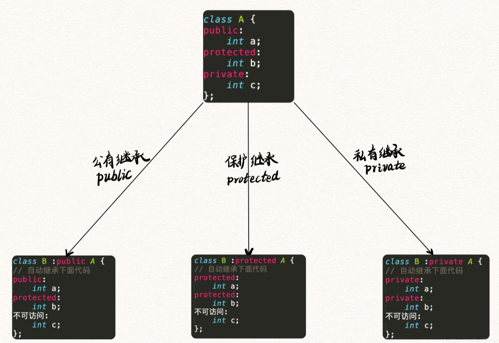

# 构造函数

C++ 构造函数就是创建类对象时自动执行的函数，编译器会默认提供3给默认构造函数，一个`构造函数`，一个`拷贝构造函数`，一个`移动构造函数`。

例子：
```cpp
class A
{

};
```

类 A 的3给默认构造函数为：
```cpp
A(); // 构造函数
A(const A&); // 拷贝构造函数
A(A&&) // 移动构造函数
```

## 构造函数初始化列表
构造函数初始化列表的语法：
```cpp
class A
{
private:
	int m_a, m_b, m_c;
public:
	A(int _a, int _b, int _c);
};
```
构造函数定义：
```cpp
A::A(int _a, int _b, int _c) :
	m_a(_a),
	m_b(_b),
	m_c(_c)
{
	std::cout << "a: " << m_a << std::endl;
	std::cout << "b: " << m_b << std::endl;
	std::cout << "c: " << m_c << std::endl;
}
```

也可以在函数体内初始化：
```cpp
A::A(int _a, int _b, int _c)
{
	m_a = _a;
	m_b = _b;
	m_c = _c;

	std::cout << "a: " << m_a << std::endl;
	std::cout << "b: " << m_b << std::endl;
	std::cout << "c: " << m_c << std::endl;
}
```

## 类继承


类成员权限：共有（`public`）、保护（`protected`）、私有（`private`）。
继承分为：共有继承（`public`）、保护继承（`protected`）、私有继承（`private`）。

## 共有继承（public）

共有继承可以访问 `public`和`protected`下的内容，`private`下的无法访问。也就是**共有继承**会把父类中除私有（`private`）成员外的 `public` 和 `protected` 给继承下来。父类中的 `private` 在子类中无法访问，也就是没有继承下来。

## 保护继承（protected）

保护继承可以访问父类中的 `public`和`protected`下的内容，但是父类中的 `public` 在子类中将会变为 `protected`权限，私有权限任然为私有不可访问。保护继承会把父类中的`public`和`protected`继承为 `protected`，`private` 不做继承，也就无法访问。

## 私有继承（private）

私有继承会把父类中的 `public`和`protected`继承为`private`，父类中的 `private` 不做继承，也就无法访问。

## 访问父类中的 private 成员

默认我们无法在子类中访问父类中的 `private` 成员，但是我们可以通过父类的 `public` 或 `protected` 成员函数来间接的访问父类中的 `private` 成员。
