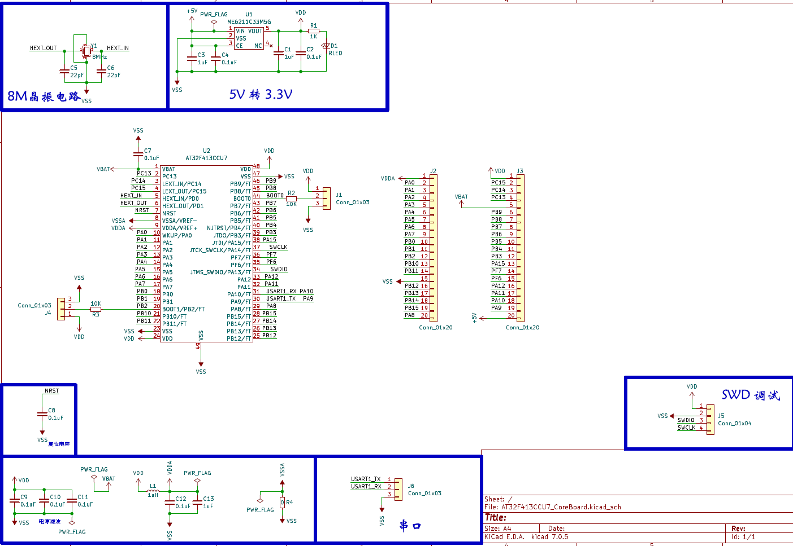

在此分享一个我画的AT32F413CCU7核心板原理图，该原理图使用 KiCAD 绘制，并且已在嘉立创打了版，经测试正常。

链接：https://pan.baidu.com/s/1_OIfiv8Prb3favvymzhYgg?pwd=u6ga 
提取码：u6ga

## BOM 表链接

<iframe
    src="/html/AT32F413CCU7核心板bom.html"
    style={{width: '100%', height: '700px'}}
    frameborder="0"
    allowfullscreen>

</iframe>