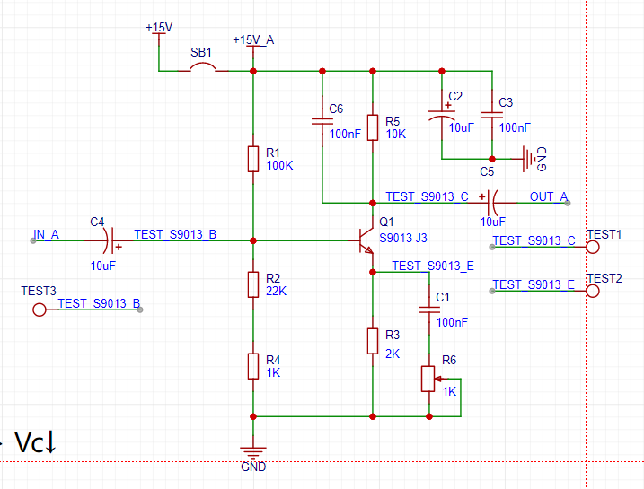

《晶体管电路设计上下册》是两本关于三极管以及MOS管电路设计的书。

## 简单的5倍放大器

一下是5倍放大器的原理图：

现在我们来分析一下上面的电路图，先把 `R4` 短路让`R2`直接接地，让后再来分析。

### Vb 三极管基极电位计算

先不考虑三极管的输入阻抗，那么三极管的基极电位也就是 `R1` 和 `R2` 分压得来的，计算结果约等于 `2.7V`。

实际 Vb 肯定要比 `2.7V` 低，应为 `R2` 和 `Vbe+R3`是并联关系。

### Ve 发射极电位

`Ve` 等于 `Vb - Vbe(0.6V)`，约为 `2.1V`。

### Ie 发射极静态电流

`Ie = Ve/R3=1mA`

### Vc 集电极静态电位

`Vc = Vcc - Vr5`，`Vr5 = Ie * R5 = 0.001 * 10000 = 10V`。

现在 Vc = Vcc(15v) - Vr5(10V)  = 5V 

### VCE 集电极与发射极之间的电压

`VCE = VCC - VE - Vr5 = 15 - 2.1 - 10 = 5-2.1= 2.9V`
