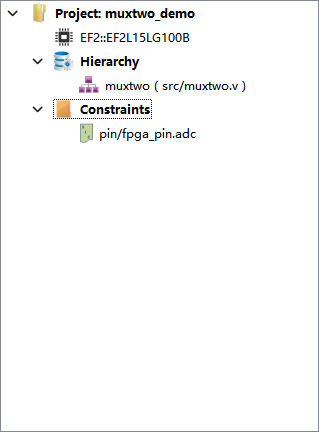

用安路的 `DT` 工具创建一个项目，并且写一个**二选一多路选择器**，最终下载的开发板中观察运行结果是否正确。

我用的开发板为：PotatoPie V2.0，淘宝地址：https://item.taobao.com/item.htm?spm=a1z10.1-c.w4023-24745921118.2.67681f7awRuTcd&id=712956051821

## 第一步
首先用 DT 创建一个空项目，新建项目对话框：


选择正确的器件系列和器件型号，这里我的 fpga 型号为：`EF2L15LG100B`。

创建后的空项目结果如图：


## 第二步

然后添加源文件，方法下图：


在 `Hierarchy` 上右击鼠标选择 `New Source` ，在弹出的对话框中输入要新建的文件名以及使用的语言，语言我们选择 `Verilog`。并且选中 `Add To Project` 复选框，这样会自动把创建的文件添加的项目中。


## 第三步
muxtwo.v 源文件代码如下：
```verilog
/*
	二选一多路选择器：
	sl 为低电平时 out 和 a 的电平一致
	sl 为高电平时 out 和 b 的电平一致
	
	我的板子为安路的：EF2L15LG100B
	IO约束中 a,b,sl都有内部上拉，所以这3给引脚默认为高电平
	out接到了板子的LED2，并且低电平点亮，高电平熄灭
	所以把该程序下载到板子后 LED是熄灭的状态
	要点亮 LED2，就需要把 b 对应的引脚接到 GND.
	经过测试程序是正确的，把 b 接到 GND后，LED2也确实亮了，断开后会在此熄灭，这样说明 out 的状态是实时根据 a,b,sl的状态而变化的。
*/
module muxtwo(out, a, b, sl);
	input a,b,sl;
	output out;
	
	reg out;
	
	always @ (sl or a or b)
		if (!sl)
			out = a;
		else
			out = b;
endmodule

```

## 第四步

添加 IO 约束，也就是把模块端口约束的对应的芯片 IO口。

在 DT 软件中选择 `Tools/IO Constraint`


IO 约束对话框：


要说明的是在代码写完后，需要整体运行一遍，否则不能顺利的进行 IO 约束，也就是简单的说明下具体的步骤。

约束中最主要的就是把我们写的模块的端口约束的正确的芯片 IO 口，并且设置`IOSTANDARD`,我的板子上所有 Bank 都是 3.3v供电，所以选择 `LVCMOS33`。

可以看到 a,b,sl对应的IO使能了上拉电阻，这样默认这三个引脚就是高电平。

在做实验时要注意这些电平的逻辑。

约束完之后，点击 `Run` 进行整体编译工作，如果没有错误，就可以把生成的 `.bit` 文件下载的板子了。


## 第五步

最后就是下载程序了，把生成的 .bit 下载的板子中。其实有两种下载到板子的类型，一种是一次性的，在断电重启后会恢复之前的程序，另一种是永久性的。


首先把板子连接到电脑，在下载对话框能看到芯片的型号说明连接成功。

点击 `Add`添加 `.bit` 文件，然后点击 `Rup`即可下载程序的板子，默认模式是 `JTAG`，该模式是一次新的，我们也可以选择 `PROGRAM FLASH`默认来把程序永久性的写到芯片内部的`FLASH`中。

经过实验，逻辑完全正确，至此**二选一多路选择器**实验完成。

最终的 DT 项目结果如下图：

