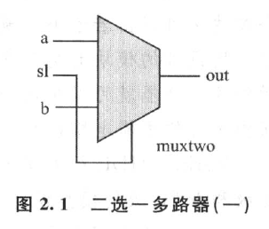

来看一个简单的例子，二选一多路选择器：

```verilog
module muxtwo(out, a, b, sl);
	input a,b,sl;
	output out;

	reg out;

	always @ (sl or a or b)
		if (!sl) out = a;
		else out = b;

endmodule
```



图2.1 是二选一多路选择器的示意图，输出 `out` 与 `a` 一致，还是与 `b` 一致，有`sl` 的电平决定。当控制信号 `sl` 为非（低电平`0`）时，输出 `out` 与输入 `a` 相同，否则与 `b` 相同。

`always @ (sl or a or b)` 表示只要 `sl` 或 `a` 或 `b`，其中若有一个变化时就执行下面的语句。


## 用 ~ & | 操作符来实现二选一多路选择器

```verilog
module muxtwo (out, a, b, sl);
	input a,b,sl;
	output out;

	wire nsl,sela,selb; 		// 定义内部连接线

	assign nsl = ~sl; 			// 求反
	assign sela = a & nsl; 		// 按位与运算
	assign selb = b &sl;
	assign out = sela | selb; 	// 按位或运算

endmodule
```


## 例子3

如图2.3所示多路选择器的 Verilog HDL 程序如下：
```verilog
module muxtwo (out,a,b,sl);
	input a,b,sl;
	output out;

	not	u1(nsl, sl);
	and #1 u2(sela,a,nsl);
	and #1 u3(selb,b,sl);
	or #1 u4(out,sela,selb);
endmodule
```


该程序中的 `not` `and` 和 `or` 都是 `Verilog` 语言的保留字，有 `Verilog` 语言的原语（`primitive`）规定了它们的接口顺序和用法，其中元件的输出口都规定在第一个端口。 `u1`,`u2`,`u3`,`u4`与逻辑图中的逻辑元件对应，表示逻辑元件的实例名称。

如果编写的 `Verilog` 模块完成正确，就可以通过计算机程序把[例2.1]通过[例2.2]的中间形式自动转换为[例2.3]形式的模块，这个过程称为综合（`synthesis`）。

