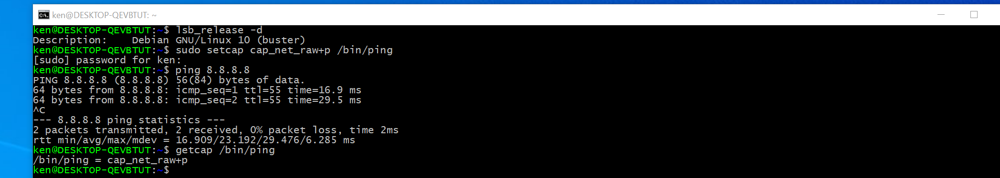

今天在 WSL2 上新安装了 Debian 系统，在执行 ping 命令时遇到以下错误提示：

```bash
zsf@hasee:~$ ping google.com
ping: socktype: SOCK_RAW
ping: socket: Operation not permitted
ping: => missing cap_net_raw+p capability or setuid?
```


解决办法：

[Ping not working in wsl2 debian. · Issue #5109 · microsoft/WSL (github.com)](https://github.com/microsoft/WSL/issues/5109)

