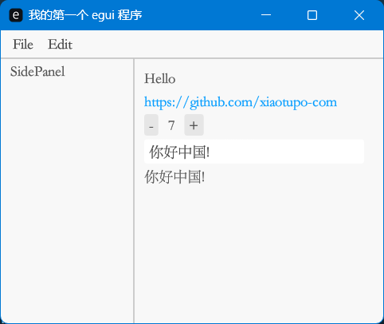
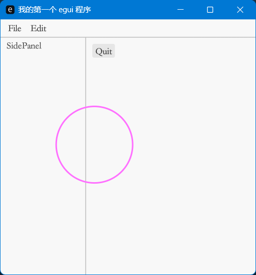
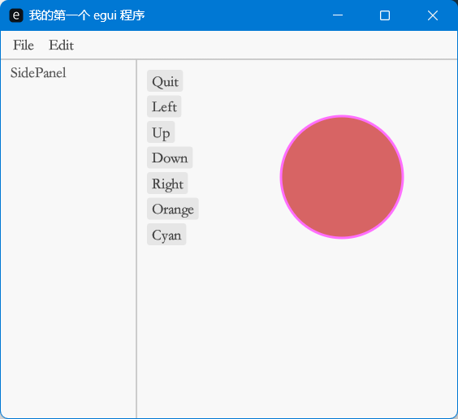
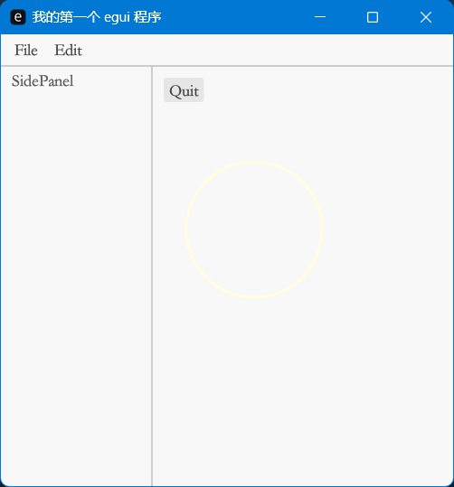
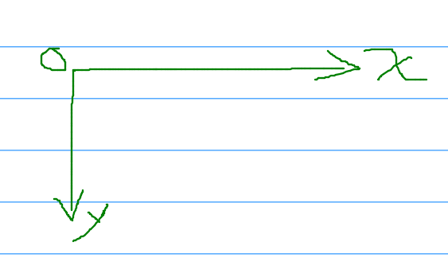

# egui 笔记

## 几个容器部件

1. [SidePanel](https://docs.rs/egui/latest/egui/containers/panel/struct.SidePanel.html)
2. [TopBottomPanel](https://docs.rs/egui/latest/egui/containers/panel/struct.TopBottomPanel.html)
3. [CentralPanel](https://docs.rs/egui/latest/egui/containers/panel/struct.CentralPanel.html)
4. [Window](https://docs.rs/egui/latest/egui/containers/struct.Window.html)
5. [Area](https://docs.rs/egui/latest/egui/containers/struct.Area.html)

## 自定义字体

[https://github.com/emilk/egui/blob/39b63f6163c7aabbf20138b505f0c86d62977408/examples/custom_font/src/main.rs](https://github.com/emilk/egui/blob/39b63f6163c7aabbf20138b505f0c86d62977408/examples/custom_font/src/main.rs)

## 例子代码

### 例子1



#### Cargo.toml

```toml
[package]
name = "hello_egui"
version = "0.1.0"
edition = "2021"

# See more keys and their definitions at https://doc.rust-lang.org/cargo/reference/manifest.html

[dependencies]
eframe = "0.24.1"
```

#### 源码

```rust
use eframe::egui;

#[derive(Default)]
struct ExampleApp {
    counter: i32,
    text_string: String,
}

impl ExampleApp {
    
}

impl eframe::App for ExampleApp {
    fn update(&mut self, ctx: &egui::Context, _frame: &mut eframe::Frame) {
        ctx.set_pixels_per_point(1.5);

        let mut fonts = egui::FontDefinitions::default();
        fonts.font_data.insert(
            "my_font".to_owned(),
            egui::FontData::from_static(include_bytes!("../assets/fonts/STSONG.TTF")),
        );
        // 将我的字体放在首位（最高优先级）用于比例文本：
        fonts
            .families
            .entry(egui::FontFamily::Proportional)
            .or_default()
            .insert(0, "my_font".to_owned());
        // 将我的字体作为等宽字体的最后后备：
        fonts
            .families
            .entry(egui::FontFamily::Monospace)
            .or_default()
            .push("my_font".to_owned());
        ctx.set_fonts(fonts);
        egui::TopBottomPanel::top("top_panel").show(ctx, |ui| {
            egui::menu::bar(ui, |ui| {
                ui.menu_button("File", |ui| {
                    if ui.button("Save").clicked() {}
                    if ui.button("Quit").clicked() {
                        std::process::exit(0);
                    }
                });

                ui.menu_button("Edit", |ui| {
                    if ui.button("Cut").clicked() {}

                    if ui.button("Copy").clicked() {}

                    if ui.button("Paste").clicked() {}
                })
            });
        });

        egui::SidePanel::left("left_panel")
            .resizable(true)
            .show(ctx, |ui| {
                ui.label("SidePanel");
            });

        egui::CentralPanel::default().show(ctx, |ui| {
            ui.add(egui::Label::new("Hello"));
            ui.add(egui::Hyperlink::new("https://github.com/xiaotupo-com"));
            ui_counter(ui, &mut self.counter);
            ui.text_edit_singleline(&mut self.text_string);
            ui.label(&self.text_string);
        });
    }
}

fn ui_counter(ui: &mut egui::Ui, counter: &mut i32) {
    ui.horizontal(|ui| {
        if ui.button("-").clicked() {
            *counter -= 1;
        }

        ui.label(counter.to_string());
        if ui.button("+").clicked() {
            *counter += 1;
        }
    });
}

fn main() -> eframe::Result<()> {
    // 远程桌面程序选项设置
    let native_options = eframe::NativeOptions {
        viewport: egui::ViewportBuilder::default().with_inner_size((400.0, 400.0)),
        ..eframe::NativeOptions::default()
    };

    // 运行原生桌面程序
    eframe::run_native(
        "我的第一个 egui 程序",
        native_options,
        Box::new(|_| Box::<ExampleApp>::default()),
    )
}

```

### 例子2



#### 源码

```rust
use eframe::egui;
use egui::Color32;
use egui::Stroke;


struct ExampleApp {
    cx: f32,
    cy: f32,
}

// 让 ExampleApp 实现 Default 功能
impl Default for ExampleApp {
    fn default() -> Self {
        Self {
            cx: 100.0,
            cy: 100.0,
        }
    }
}

impl eframe::App for ExampleApp {
    fn update(&mut self, ctx: &egui::Context, _frame: &mut eframe::Frame) {
        self.cy += 0.7;
        self.cx += 0.25;

        ctx.set_pixels_per_point(1.5);

        let mut fonts = egui::FontDefinitions::default();
        fonts.font_data.insert(
            "my_font".to_owned(),
            egui::FontData::from_static(include_bytes!("../assets/fonts/STSONG.TTF")),
        );
        // 将我的字体放在首位（最高优先级）用于比例文本：
        fonts
            .families
            .entry(egui::FontFamily::Proportional)
            .or_default()
            .insert(0, "my_font".to_owned());
        // 将我的字体作为等宽字体的最后后备：
        fonts
            .families
            .entry(egui::FontFamily::Monospace)
            .or_default()
            .push("my_font".to_owned());
        // 设置字体
        ctx.set_fonts(fonts);

        // TopBottomPanel
        egui::TopBottomPanel::top("top_panel").show(ctx, |ui| {
            egui::menu::bar(ui, |ui| {
                ui.menu_button("File", |ui| {
                    if ui.button("Save").clicked() {}
                    if ui.button("Quit").clicked() {
                        std::process::exit(0);
                    }
                });

                ui.menu_button("Edit", |ui| {
                    if ui.button("Cut").clicked() {}

                    if ui.button("Copy").clicked() {}

                    if ui.button("Paste").clicked() {}
                })
            });
        });

        // SidePanel
        egui::SidePanel::left("left_panel")
            .resizable(true)
            .show(ctx, |ui| {
                ui.label("SidePanel");
            });
        // CentralPanel
        egui::CentralPanel::default().show(ctx, |ui| {
            exit_app(ui); // 实现按键退出

            // 创建一个画家
            let painter = ui.painter();

            painter.circle(
                egui::Pos2 {
                    x: self.cx,
                    y: self.cy
                },
                50.0,
                Color32::TRANSPARENT,
                Stroke {
                    width: 2.0,
                    color: Color32::from_rgb(255,111,255),
                }
            );
        });
    }
}

// 退出按钮
fn exit_app(ui: &mut egui::Ui) {
    if ui.button("Quit").clicked() {
        std::process::exit(0);
    }
}

fn main() -> eframe::Result<()> {
    // 远程桌面程序选项设置
    let native_options = eframe::NativeOptions {
        viewport: egui::ViewportBuilder::default().with_inner_size((400.0, 400.0)),
        ..eframe::NativeOptions::default()
    };

    // 运行原生桌面程序
    eframe::run_native(
        "我的第一个 egui 程序",
        native_options,
        Box::new(|_| Box::<ExampleApp>::default()),
    )
}

```

### 例子3

截图：


#### 源码

```rust
use eframe::egui;
use egui::Color32;
use egui::Stroke;


struct ExampleApp {
    cx: f32,
    cy: f32,
    cc: Color32,
}

// 让 ExampleApp 实现 Default 功能
impl Default for ExampleApp {
    fn default() -> Self {
        Self {
            cx: 100.0,
            cy: 100.0,
            cc: Color32::BLUE,
        }
    }
}

impl eframe::App for ExampleApp {
    fn update(&mut self, ctx: &egui::Context, _frame: &mut eframe::Frame) {
        ctx.set_pixels_per_point(1.5);

        let mut fonts = egui::FontDefinitions::default();
        fonts.font_data.insert(
            "my_font".to_owned(),
            egui::FontData::from_static(include_bytes!("../assets/fonts/STSONG.TTF")),
        );
        // 将我的字体放在首位（最高优先级）用于比例文本：
        fonts
            .families
            .entry(egui::FontFamily::Proportional)
            .or_default()
            .insert(0, "my_font".to_owned());
        // 将我的字体作为等宽字体的最后后备：
        fonts
            .families
            .entry(egui::FontFamily::Monospace)
            .or_default()
            .push("my_font".to_owned());
        // 设置字体
        ctx.set_fonts(fonts);

        // TopBottomPanel
        egui::TopBottomPanel::top("top_panel").show(ctx, |ui| {
            egui::menu::bar(ui, |ui| {
                ui.menu_button("File", |ui| {
                    if ui.button("Save").clicked() {}
                    if ui.button("Quit").clicked() {
                        std::process::exit(0);
                    }
                });

                ui.menu_button("Edit", |ui| {
                    if ui.button("Cut").clicked() {}

                    if ui.button("Copy").clicked() {}

                    if ui.button("Paste").clicked() {}
                })
            });
        });

        // SidePanel
        egui::SidePanel::left("left_panel")
            .resizable(true)
            .show(ctx, |ui| {
                ui.label("SidePanel");
            });
        // CentralPanel
        egui::CentralPanel::default().show(ctx, |ui| {
            exit_app(ui); // 实现按键退出

            // Left
            if ui.button("Left").clicked() {
                self.cx += -20.00
            }

            // Up
            if ui.button("Up").clicked() {
                self.cy += -20.00
            }

            // Down
            if ui.button("Down").clicked() {
                self.cy += 20.00
            }

            // Right
            if ui.button("Right").clicked() {
                self.cx += 20.00
            }

            // Orange
            if ui.button("Orange").clicked() {
                self.cc = Color32::from_rgb(215, 100, 100)
            }

            // Cyan
            if ui.button("Cyan").clicked() {
                self.cc = Color32::from_rgb(000, 180, 215)
            }


            // 创建一个画家
            let painter = ui.painter();

            painter.circle(
                egui::Pos2 {
                    x: self.cx,
                    y: self.cy
                },
                50.0,
                self.cc,
                Stroke {
                    width: 2.0,
                    color: Color32::from_rgb(255,111,255),
                }
            );
        });
    }
}

// 退出按钮
fn exit_app(ui: &mut egui::Ui) {
    if ui.button("Quit").clicked() {
        std::process::exit(0);
    }
}

fn main() -> eframe::Result<()> {
    // 远程桌面程序选项设置
    let native_options = eframe::NativeOptions {
        viewport: egui::ViewportBuilder::default().with_inner_size((400.0, 400.0)),
        ..eframe::NativeOptions::default()
    };

    // 运行原生桌面程序
    eframe::run_native(
        "我的第一个 egui 程序",
        native_options,
        Box::new(|_| Box::<ExampleApp>::default()),
    )
}

```

### 例子4

截图：


#### 源码

```rust
use eframe::egui;
use egui::Color32;
use egui::Stroke;


struct ExampleApp {}

// 让 ExampleApp 实现 Default 功能
impl Default for ExampleApp {
    fn default() -> Self {
        Self {}
    }
}

impl eframe::App for ExampleApp {
    fn update(&mut self, ctx: &egui::Context, _frame: &mut eframe::Frame) {
        ctx.set_pixels_per_point(1.5);

        let mut fonts = egui::FontDefinitions::default();
        fonts.font_data.insert(
            "my_font".to_owned(),
            egui::FontData::from_static(include_bytes!("../assets/fonts/STSONG.TTF")),
        );
        // 将我的字体放在首位（最高优先级）用于比例文本：
        fonts
            .families
            .entry(egui::FontFamily::Proportional)
            .or_default()
            .insert(0, "my_font".to_owned());
        // 将我的字体作为等宽字体的最后后备：
        fonts
            .families
            .entry(egui::FontFamily::Monospace)
            .or_default()
            .push("my_font".to_owned());
        // 设置字体
        ctx.set_fonts(fonts);

        // TopBottomPanel
        egui::TopBottomPanel::top("top_panel").show(ctx, |ui| {
            egui::menu::bar(ui, |ui| {
                ui.menu_button("File", |ui| {
                    if ui.button("Save").clicked() {}
                    if ui.button("Quit").clicked() {
                        std::process::exit(0);
                    }
                });

                ui.menu_button("Edit", |ui| {
                    if ui.button("Cut").clicked() {}

                    if ui.button("Copy").clicked() {}

                    if ui.button("Paste").clicked() {}
                })
            });
        });

        // SidePanel
        egui::SidePanel::left("left_panel")
            .resizable(true)
            .show(ctx, |ui| {
                ui.label("SidePanel");
            });
        // CentralPanel
        egui::CentralPanel::default().show(ctx, |ui| {
            exit_app(ui); // 实现按键退出

            // 获取鼠标位置
            let hover_pos = ctx.input(|input| {
                let pointer = &input.pointer;
                pointer.hover_pos()
            });

            // 创建一个画家
            let painter = ui.painter();

            if let Some(mousepos) = hover_pos {
                painter.circle(
                    mousepos,
                    50.0,
                    Color32::TRANSPARENT,
                    Stroke {
                        width: 2.0,
                        color: Color32::LIGHT_YELLOW,
                    }
                );
            }
        });
    }
}

// 退出按钮
fn exit_app(ui: &mut egui::Ui) {
    if ui.button("Quit").clicked() {
        std::process::exit(0);
    }
}

fn main() -> eframe::Result<()> {
    // 远程桌面程序选项设置
    let native_options = eframe::NativeOptions {
        viewport: egui::ViewportBuilder::default().with_inner_size((400.0, 400.0)),
        ..eframe::NativeOptions::default()
    };

    // 运行原生桌面程序
    eframe::run_native(
        "我的第一个 egui 程序",
        native_options,
        Box::new(|_| Box::<ExampleApp>::default()),
    )
}

```

## egui 坐标



