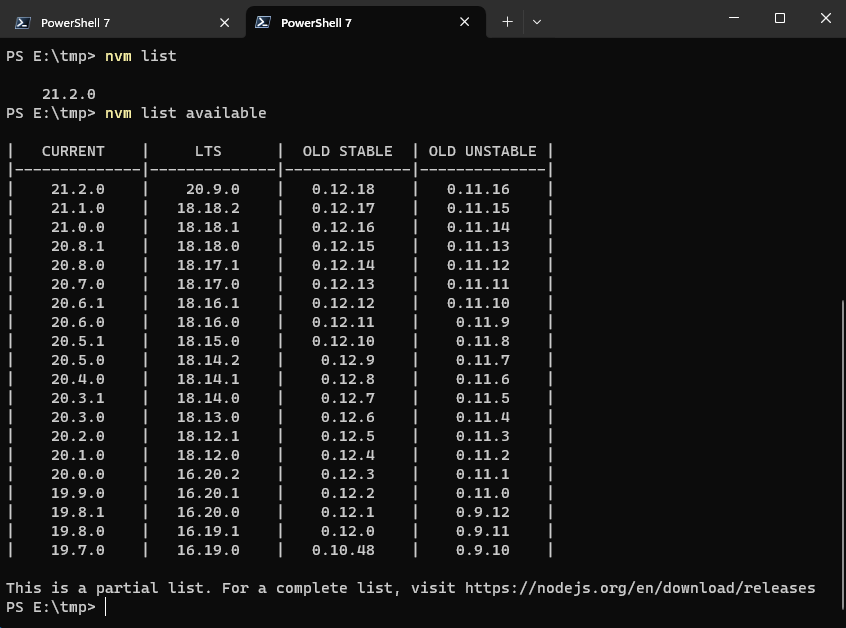

## nvm-windows

我的系统是 `Windows` 所有要用 [nvm-windows](https://github.com/coreybutler/nvm-windows)，下载 `nvm-setup.zip` 或 `nvm-setup.exe`。

安装前可以把已有的版本卸载了，然后需要那个版本就用 `nvm` 下载那个版本。

### 安装 Node.js

先查看已安装版本：

```bash
nvm list
```

查看可安装的版本：

```bash
nvm list available
```



### 安装最新版本

```bash
nvm install latest
```

### 安装最新 LTS 版本

```bash
nvm install lts
```

### 切换 node 版本

`nvm ls` 查看已安装版本，前面有 `*` 符号的是当前用的 node 版本，

切换版本用:

```bash
nvm use 21.2.0
```

### 删除不用的版本

```bash
nvm uninstall 21.2.0
```

